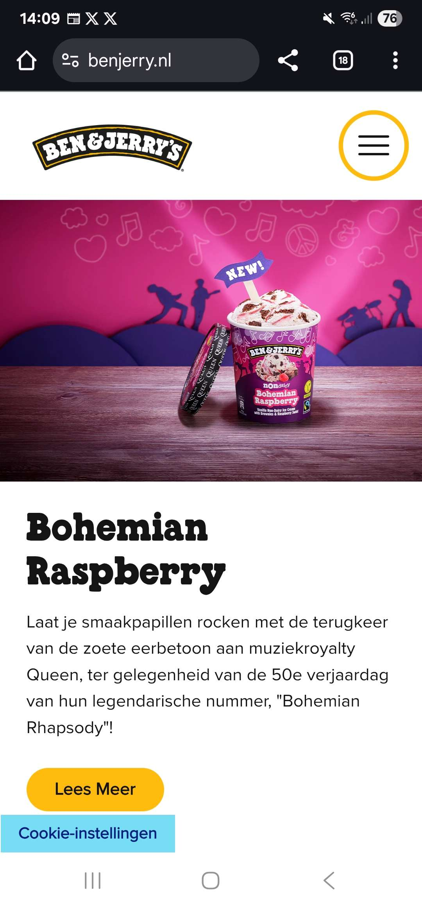
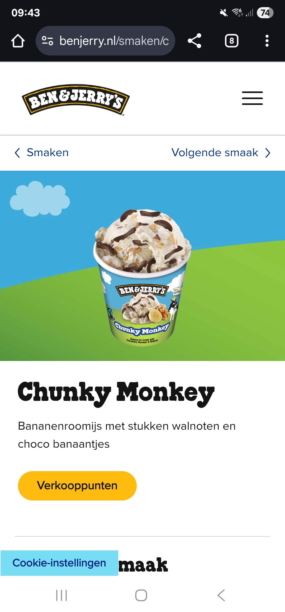
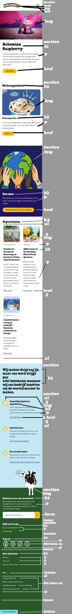
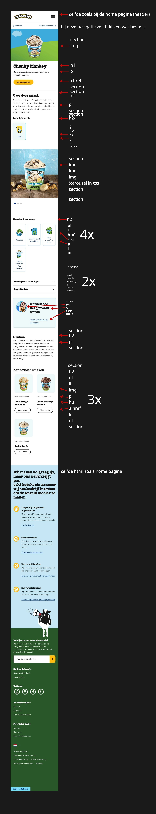

# Procesverslag
Markdown is een simpele manier om HTML te schrijven.  
Markdown cheat cheet: [Hulp bij het schrijven van Markdown](https://github.com/adam-p/markdown-here/wiki/Markdown-Cheatsheet).

Nb. De standaardstructuur en de spartaanse opmaak van de README.md zijn helemaal prima. Het gaat om de inhoud van je procesverslag. Besteedt de tijd voor pracht en praal aan je website.

Nb. Door *open* toe te voegen aan een *details* element kun je deze standaard open zetten. Fijn om dat steeds voor de relevante stuk(ken) te doen.

## Jij

  
uitwerken voor kick-off werkgroep

  ### Auteur:
  Ali

  #### Je startniveau:
  blauw

  #### Je focus:
 surface plane
 

## Je website

  
uitwerken voor kick-off werkgroep

  ### Je opdracht:
https://www.benjerry.nl

  #### Screenshot(s) van de eerste pagina (small screen): 
  Homepagina
  

  #### Screenshot(s) van de tweede pagina (small screen):
Smakenpagina
  
 

## Toegankelijkheidstest 1/2 (week 1)

  
uitwerken na test in 2e werkgroep

  ### Bevindingen
  Lijst met je bevindingen die in de test naar voren kwamen:
  1. Contrast niet overal voldoende Sommige teksten staan op felle of drukke achtergronden (foto’s, kleurvlakken).
  
  2. Niet alle afbeeldingen hebben duidelijke alt-teksten Een deel van de afbeeldingen hebben beperkte alt-tektsten

  3. Sommige buttons en links bevatten generieke teksten zoals “Meer” waardoor de actie niet altijd duidelijk is.

  4. Soms worden meerdere H1-elementen per pagina gebruikt (bijvoorbeeld in promotionele banners).

  5.Sommige visuele lijsten worden met divs gebouwd zonder semantiek. Gedeeltelijk voldaan.
  
  6. De site ondersteunt geen dark mode.
  
  7. Met Tab ga je gelijk naar de footer, waardoor je niet kan navigeren door de pagina 

## Breakdownschets (week 1)

  
uitwerken na afloop 3e werkgroep

    

  ### de hele pagina: 
  

  ### dynamisch deel (bijv menu): 
  

  ### wellicht nog een dynamisch deel (bijv filter): 
  

## Voortgang 1 (week 2)

  
uitwerken voor 1e voortgang

  ### Stand van zaken
  Wat goed ging, was het bepalen en uitschetsen van de HTML-structuur. Hoewel ik niet zo goed ben in coderen, ben ik blij dat ik de basisprincipes die ik tijdens Internetstandaarden heb geleerd nog redelijk goed onder de knie heb. Waar ik moeite mee had, was om langdurig achter mijn laptop te werken, omdat ik momenteel oogproblemen heb en daardoor deels wazig zie.

  ### Agenda voor meeting
  samen met je groepje opstellen

  | student 1      | student 2          | student 3    | student 4        |
  | ---            | ---                | ---          | ---              |
  | dit bespreken  | en dit             | en ik dit    | en dan ik dat    |
  | en dat ook nog | dit als er tijd is | nog een punt | dit wil ik zeker |
  | ...            | ...                | ...          | ...              |

  ### Verslag van meeting
  hier na afloop snel de uitkomsten van de meeting vastleggen

 -De HTML van mijn homepagina zag er goed uit, omdat Ivo en ik er in de les samen naar hadden gekeken. Ik kreeg wel als tip dat ik mijn H1 eventueel “invisible” kon maken, omdat de hele pagina niet alleen over Bohemian Raspberry gaat. Verder zag mijn HTML er semantisch goed uit.

## Voortgang 2 (week 3)

  
uitwerken voor 2e voortgang

  ### Stand van zaken
  Dankzij Ivo’s advies had ik in week 3 twee semantische HTML-pagina’s, wat al een flinke vooruitgang was vergeleken met hoe de originele Ben & Jerry’s-pagina eruitzag.

  ### Agenda voor meeting
  samen met je groepje opstellen

  | student 1      | student 2          | student 3    | student 4        |
  | ---            | ---                | ---          | ---              |
  | dit bespreken  | en dit             | en ik dit    | en dan ik dat    |
  | en dat ook nog | dit als er tijd is | nog een punt | dit wil ik zeker |
  | ...            | ...                | ...          | ...              |

  ### Verslag van meeting
  hier na afloop snel de uitkomsten van de meeting vastleggen

  - Wegens mijn huidige aandoening, staar, was mijn werktempo niet optimaal. Idealiter wilde ik in week 3 al klaar zijn met beide HTML-pagina’s en het voorwerk voor mijn CSS hebben gedaan, maar dat is helaas niet gelukt. Eerder in de week had ik de HTML van deze pagina al aan Ivo laten zien, dus tijdens deze meeting zag mijn tweede HTML-pagina er goed uit. Daarnaast kreeg ik nog tips over welke surface-plane-elementen ik aan mijn website zou kunnen toevoegen, zoals een knop om de lettergrootte groter of kleiner te maken voor extra toegankelijkheid.

## Toegankelijkheidstest 2/2 (week 4)

  
uitwerken na test in 9e werkgroep

 
  ### Bevindingen
  1. De light- en darkmodus die ik zelf heb toegevoegd, helpen enorm bij het makkelijker bekijken van de content. Door mijn staar vind ik websites en applicaties met een darkmodus op dit moment veel prettiger om te gebruiken.
  2. De lettergrootte-controls die ik momenteel in mijn navigatie heb staan, helpen om de content beter leesbaar te maken. Daarnaast heb ik met een eenvoudige CSS-hoverfunctie ervoor gezorgd dat bepaalde links iets groter worden wanneer je eroverheen hovert. Dit geeft bezoekers een duidelijkere indicatie dat het om een knop gaat. Voor gebruikers die minder bekwaam zijn in het navigeren van websites kan dit een kleine maar handige ondersteuning zijn. Naar mijn mening verpest deze functie de huisstijl van de website absoluut niet.
  3. Ik heb ook rekening gehouden met gebruikers die mogelijk gewrichtsproblemen hebben. Wanneer een website erg lang is, kan veel scrollen namelijk belastend zijn. Daarom heb ik een functie toegevoegd waarmee gebruikers automatisch terug naar de bovenkant van de pagina kunnen gaan. Op een toetsenbord bestaat hiervoor natuurlijk de Page Up-toets, maar lang niet iedereen weet dat deze functie bestaat. Daarom heb ik ervoor gekozen om deze mogelijkheid zichtbaar en toegankelijk in mijn website toe te voegen.
  4. De carrousel die op de Chunky Monkey-pagina van de originele Ben & Jerry’s-website staat, werkt alleen wanneer je met je muis of vinger veegt. In mijn versie kun je ook simpelweg klikken om de volgende foto te zien. Dit is naar mijn mening minder belastend voor de gewrichten van bezoekers.
  5. De alt-teksten worden in mijn website veel duidelijker uitgesproken door de screenreader. Op de website van Ben & Jerry’s hoorde ik veel onnodige ‘filler’-informatie, omdat hun code minder semantisch is opgebouwd dan die van mij.

## Voortgang 3 (week 4)

  
uitwerken voor 3e voortgang

  ### Stand van zaken
  Wat goed ging, was het nabootsen van de huisstijl van Ben & Jerry’s, zodat het geheel goed op elkaar aansloot. Wat ik lastig vond, was het bedenken van oplossingen binnen het surface plane challenge. Naar mijn mening zag het er al vrij goed uit. Het klinkt misschien vreemd dat ik dit zeg, maar door mijn staar merkte ik dat ik graag bepaalde tekst op de pagina groter zou kunnen maken, zodat ik de content makkelijker kan lezen. Dit had ik ook vorige week als tip gekregen voor een eventuele surface plane element. Daarom had ik in een notitie gezet dat dit een functie is die ik graag verder zou willen uitwerken.

  ### Agenda voor meeting
  samen met je groepje opstellen

  | student 1      | student 2          | student 3    | student 4        |
  | ---            | ---                | ---          | ---              |
  | dit bespreken  | en dit             | en ik dit    | en dan ik dat    |
  | en dat ook nog | dit als er tijd is | nog een punt | dit wil ik zeker |
  | ...            | ...                | ...          | ...              |

  ### Verslag van meeting
  hier na afloop snel de uitkomsten van de meeting vastleggen

  -Tijdens de laatste feedbacksessie hebben we naar mijn code gekeken. Over het algemeen zag het er goed uit, maar ik kreeg wel het advies om de afbeeldingen in GitHub te plaatsen, omdat het last-minute uploaden daarvan nogal gedoe kan opleveren. Daarnaast leek het voorwerk van mijn CSS op dat van Ben & Jerry’s. Ik kreeg daarom het advies om goed na te denken over wat ik kan verbeteren en wat Ben & Jerry’s niet heeft, aangezien ik voor surface plane heb gekozen.

## Eindgesprek (week 5)

  
uitwerken voor eindgesprek

  ### Je uitkomst - karakteristiek screenshots:
  

  ### Dit ging goed/Heb ik geleerd: 
    1. Wat goed is gegaan, is het nabootsen van de huisstijl van Ben & Jerry’s. Ook met mijn extra functies wijkt de vormgeving naar mijn mening niet af van de originele stijl. Misschien valt de otter die je ziet tijdens het korte laadscherm iets meer op, maar door de blauwe achtergrond past dit moment toch goed binnen de totale huisstijl en houdt het alles mooi bij elkaar.
    2. Ook heb ik een beetje met mediaqueries gewerkt om bepaalde elementen beter responsive te maken, zoals bijvoorbeeld de waardevolle aankoop-grid.
    3. Na de lessen Inleiding Programmeren was ik een deel van de basisprincipes van JavaScript weer een beetje verleerd. Door de surface plane-challenge die ik had gekozen, heb ik deze kennis naar mijn mening weer goed kunnen opfrissen.

  

  ### Dit was lastig/Is niet gelukt:
    1. Ik wilde nog een video toevoegen, met control buttons maar nadat ik de video op de pagina kreeg versprong mijn hele pagina heb nog geprobeerd om het te oplossen, maar ik merkte dat het teveel tijd in beslag nam dus heb ik het gelaten

    2. Mijn letter grootte controls werken, maar kreeg ze niet aan de praat op de footer, indien ik meer tijd had was dit de volgende uitdaging geweest /update met hulp van chatgpt werkt het nu wel, ''Er is maar één regel écht nieuw in jouw JavaScript, namelijk dat we nu document.body vervangen door document.documentElement.
    Dit is de regel die nieuw is en ervoor zorgt dat de footer (en alles met rem) wél meevergroot''

    3. Ik had een ambitieus idee om een Stranger Things-promotie te maken: wanneer je op een speciale Stranger Things-smaak van Ben & Jerry’s zou klikken, zou de website in de “Upside Down”-modus gaan. De Upside Down is in Stranger Things een bekende plek waar alles op zijn kop staat. Ik wilde daarbij ook dat de huisstijl rood zou worden. Achteraf bleek dit idee echter veel te ambitieus voor dit project. Misschien probeer ik het nog eens uit te werken in mijn vrije tijd.

  

## Bronnenlijst

  
continu bijhouden terwijl je werkt

  Nb. Wees specifiek ('css-tricks' als bron is bijv. niet specifiek genoeg). 
  Nb. ChatGpT en andere AI horen er ook bij.
  Nb. Vermeld de bronnen ook in je code.

  1. Tijdens de lessen heb ik aangegeven dat ik, wanneer ik er met uitleg op het internet of via tutorials niet uitkwam, ChatGPT om hulp heb gevraagd. Ik heb ChatGPT op zo’n manier gebruikt dat ik de code wél begrijp: ik heb het niet de volledige code voor me laten uitschrijven, maar laten uitleggen hoe ik kon komen waar ik wilde en of er eventueel andere oplossingen mogelijk waren. Eigenlijk heb ik ChatGPT gebruikt als een soort “robot-Ivo” die 24/7 beschikbaar was wanneer het mij niet lukte.
  2. https://css-tricks.com/practical-css-scroll-snapping/
  3. https://www.geeksforgeeks.org/javascript/allow-users-to-change-font-size-of-a-webpage-using-javascript/
  4. https://www.youtube.com/watch?v=2V1WK-3HQNk
  5. https://www.w3schools.com/howto/howto_css_loader.asp
https://developer.mozilla.org/en-US/docs/Web/API/Window/load_event
  6.  https://stackoverflow.com/questions/39673540/an-infinite-carousel-with-vanilla-javascript

